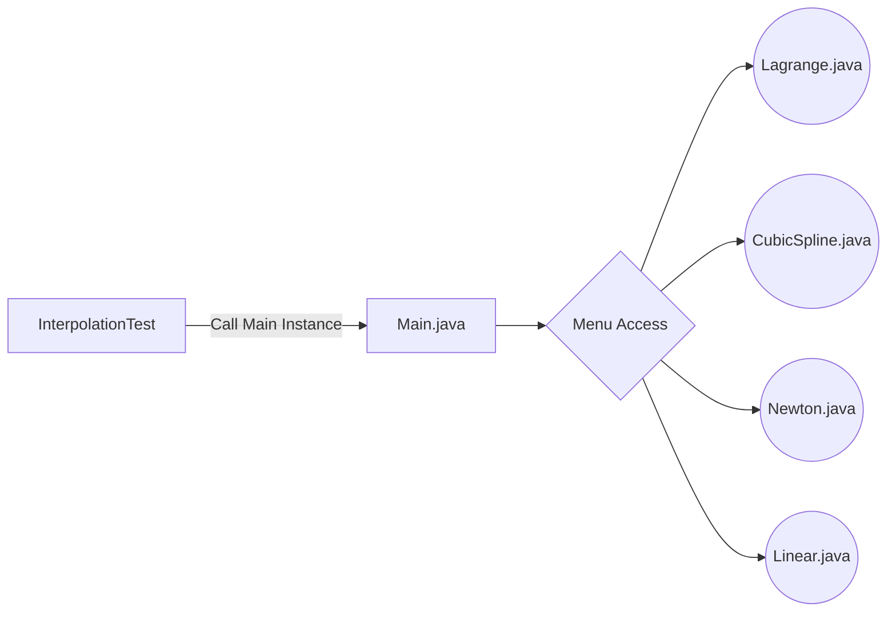

# Welcome to  Interpolations Methods!

> **Note:** This project is current in development.

# Files

 - CubicSpline.java
 - Lagrange.java
 - InterpolationMethod.java
 - Newton.java	            (In development)
 - Linear.java	            (In development)
 - Main.java	            (In development)
 - InterpolationTest.java   (In development)
 
 
 ## Interpolation Formula

**Interpolation** is a method of finding new values for any function using the given set of values. The unknown value at a particular point can be found using many interpolation formula's. If the new value has to be found from the two given points then the linear interpolation formula is used whereas if 'n' set of numbers are available the new value is found using the Lagrange's interpolation formula.

The **Linear Interpolation Formula** is given as,

The **La-grange's Interpolation Formula** is given as,

**The others formulas will be display in the next version of this repository**

## Flow Chart

